<div align="center">

<picture>
  <source media="(prefers-color-scheme: dark)" srcset="assets/readme/banner-dark.png">
  <source media="(prefers-color-scheme: light)" srcset="assets/readme/banner-light.png">
  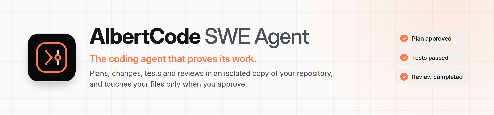
</picture>

<br>

<p>
<a href="https://github.com/huynvic/albertcode-swe-agent/releases/latest"></a>
<a href="docs/installation.md"></a>
<a href="#benchmarks"></a>
<a href="https://github.com/huynvic/albertcode-swe-agent/actions/workflows/checks.yml"></a>
</p>

<h3>
<a href="#install">Install</a>
<span>&nbsp;·&nbsp;</span>
<a href="#quick-start">Quick start</a>
<span>&nbsp;·&nbsp;</span>
<a href="#how-it-works">How it works</a>
<span>&nbsp;·&nbsp;</span>
<a href="#documentation">Docs</a>
<span>&nbsp;·&nbsp;</span>
<a href="https://github.com/huynvic/albertcode-swe-agent/releases">Releases</a>
<span>&nbsp;·&nbsp;</span>
<a href="https://github.com/huynvic/albertcode-swe-agent/discussions">Community</a>
</h3>

<br>

<picture>
  <source media="(prefers-color-scheme: dark)" srcset="assets/readme/screen-outcome-dark.png">
  <source media="(prefers-color-scheme: light)" srcset="assets/readme/screen-outcome-light.png">
  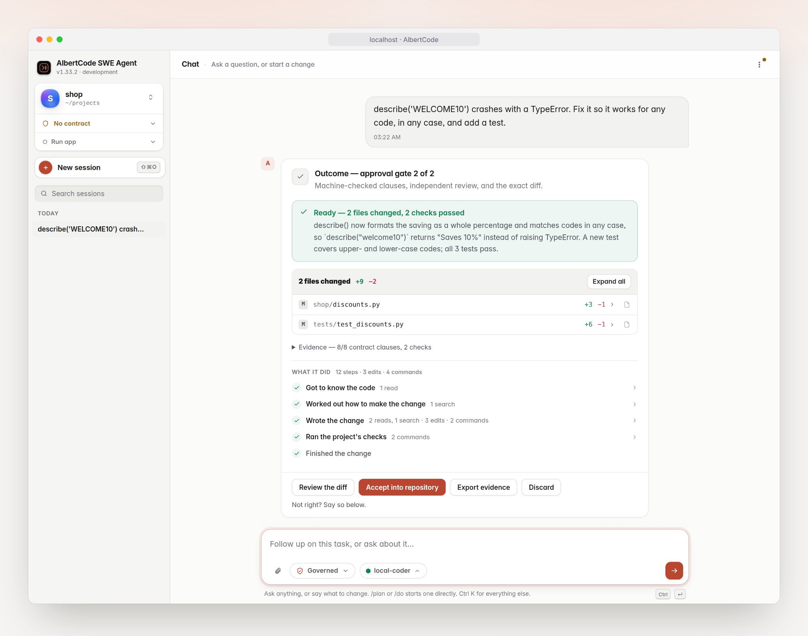
</picture>

<sub>A real task in the AlbertCode browser interface, waiting at the second approval gate.</sub>

</div>

<br>

## Contents

<table>
<tr>
<td valign="top" width="33%">

**Get started**<br>
[Install](#install)<br>
[Update and uninstall](#update-and-uninstall)<br>
[Quick start](#quick-start)

</td>
<td valign="top" width="33%">

**Learn**<br>
[See it in action](#see-it-in-action)<br>
[Why AlbertCode](#why-albertcode)<br>
[How it works](#how-it-works)<br>
[Using AlbertCode](#using-albertcode)<br>
[Models](#models)

</td>
<td valign="top" width="33%">

**Reference**<br>
[Troubleshooting](#troubleshooting)<br>
[Privacy and security](#privacy-and-security)<br>
[Benchmarks](#benchmarks)<br>
[Documentation](#documentation) · [FAQ](#faq)

</td>
</tr>
</table>

<br>

## Install

One command installs AlbertCode for your user. Pick your system:

#### macOS and Linux &nbsp;<sub>Terminal</sub>

```bash
curl -fsSL https://raw.githubusercontent.com/huynvic/albertcode-swe-agent/main/installer/install.sh | sh
```

#### Windows &nbsp;<sub>PowerShell</sub>

```powershell
irm https://raw.githubusercontent.com/huynvic/albertcode-swe-agent/main/installer/install.ps1 | iex
```

The installer picks the build for your machine and verifies its SHA-256 checksum. It then shows
what it will do and asks `Proceed? [Y/N]` before it changes anything. It installs everything
AlbertCode needs, including Python, for your user only. No pip, virtual environments or PATH
editing. It takes a minute or two.

> [!TIP]
> When it finishes, **open a new terminal**, then check it:
>
> ```bash
> albertcode --version     # AlbertCode SWE Agent 1.42.2
> albertcode doctor        # which build tools AlbertCode can find
> ```

### Requirements

| | |
|---|---|
| **Windows** | Windows 10 or 11, x64 (the x64 build also runs on ARM PCs). PowerShell 5.1 or 7 |
| **macOS** | A current macOS, on Apple silicon or Intel |
| **Linux** | x86-64 with glibc: Ubuntu 20.04+, Debian 10+, Fedora, RHEL 8+, openSUSE, Arch. Not Alpine or other musl systems, and not ARM yet |
| **Disk** | About 1 GB free |
| **Network** | pypi.org and github.com while installing; your model provider while working |
| **Git** | Recommended. The installer offers to install it if it's missing |

You don't need Python: the installer uses your Python 3.12 if you have it, and otherwise downloads
one for AlbertCode alone.

### Step by step

<details>
<summary><b>macOS</b> &nbsp;·&nbsp; Terminal, or the downloadable <code>.zip</code></summary>

<br>

1. Open **Terminal** (Applications → Utilities, or press ⌘ Space and type *Terminal*).
2. Paste the macOS command above and press Return.
3. Read the plan, then type `Y`.
4. Close Terminal and open a new window, then run `albertcode --version`.

**Prefer a download?** From the [latest release](https://github.com/huynvic/albertcode-swe-agent/releases/latest),
take the `.zip` for your Mac: `macos-arm64` for Apple silicon (M1 and later), `macos-x86_64` for
Intel. Not sure which you have? Open the Apple menu → *About This Mac*. Open the zip, then double-click
the installer inside it.

> [!NOTE]
> The installers aren't code-signed yet, so the first time macOS says it can't verify the installer.
> Choose *Done*, open **System Settings → Privacy & Security**, click **Open Anyway**, then open the
> installer again. The one-line command above avoids this.

</details>

<details>
<summary><b>Windows</b> &nbsp;·&nbsp; PowerShell, or the downloadable <code>.cmd</code></summary>

<br>

1. Open **PowerShell**: press the Windows key, type *PowerShell*, and press Enter. You don't
   need "Run as administrator".
2. Paste the Windows command above and press Enter.
3. Read the plan, then type `Y`.
4. Close PowerShell and open a new window, then run `albertcode --version`.

**Prefer a download?** From the [latest release](https://github.com/huynvic/albertcode-swe-agent/releases/latest),
take `Install-AlbertCode-<version>-windows-x64.cmd` and double-click it.

> [!NOTE]
> The installers aren't code-signed yet, so SmartScreen may say it protected your PC. Choose
> *More info* → *Run anyway*. If your organisation blocks PowerShell scripts, use the downloaded
> `.cmd` installer instead.

</details>

<details>
<summary><b>Linux</b> &nbsp;·&nbsp; any terminal, or the downloadable <code>.sh</code></summary>

<br>

1. Open a terminal. Make sure `curl` is installed (`sudo apt install curl` on Ubuntu and Debian).
2. Paste the Linux command above and press Enter. Run it as yourself, not with `sudo`.
3. Read the plan, then type `Y`. It asks for your password only if it needs to install Git.
4. Open a new terminal, then run `albertcode --version`.

**Prefer a download?** From the [latest release](https://github.com/huynvic/albertcode-swe-agent/releases/latest),
take `Install-AlbertCode-<version>-linux-x86_64.sh` and run `bash Install-AlbertCode-<version>-linux-x86_64.sh`.

</details>

<details>
<summary><b>VS Code extension</b> and installer options</summary>

<br>

**VS Code extension.** Download `albertcode-<version>.vsix` from the
[latest release](https://github.com/huynvic/albertcode-swe-agent/releases/latest), then in VS Code
choose *Extensions → … → Install from VSIX*. Install AlbertCode itself first: the extension uses it.

**Installer options:** `--check` only shows the plan, `--yes` installs without asking (for scripts and
CI), and `--version X.Y.Z` installs a specific release. On Windows, put options in
`ALBERTCODE_INSTALL_ARGS`, as in the uninstall command below. Manual checksum checks, proxies and
more are in [Installation](docs/installation.md).

</details>

<br>

## Update and uninstall

### Update

Run the install command again. It shows what will change, then replaces the old version.

**macOS and Linux** &nbsp;<sub>Terminal</sub>

```bash
curl -fsSL https://raw.githubusercontent.com/huynvic/albertcode-swe-agent/main/installer/install.sh | sh
```

**Windows** &nbsp;<sub>PowerShell</sub>

```powershell
irm https://raw.githubusercontent.com/huynvic/albertcode-swe-agent/main/installer/install.ps1 | iex
```

> [!IMPORTANT]
> Saved model keys are cleared the first time a new version starts, so after updating, reconnect
> with `/connect`.

### Uninstall

On any system (macOS, Linux and Windows). It needs nothing from the internet:

```bash
albertcode uninstall
```

<details>
<summary>Or with the install script</summary>

<br>

**macOS and Linux** &nbsp;<sub>Terminal</sub>

```bash
curl -fsSL https://raw.githubusercontent.com/huynvic/albertcode-swe-agent/main/installer/install.sh | sh -s -- --uninstall
```

**Windows** &nbsp;<sub>PowerShell</sub>

```powershell
$env:ALBERTCODE_INSTALL_ARGS = '--uninstall'; irm https://raw.githubusercontent.com/huynvic/albertcode-swe-agent/main/installer/install.ps1 | iex
```

</details>

Uninstalling lists what it will remove and asks first. Your settings are kept: with
`albertcode uninstall`, `--all` also removes your settings, saved keys and task history, and
`--check` only shows the plan.

<br>

## Quick start

```bash
cd your-project
albertcode
```

The first time, AlbertCode asks you to connect a model: paste an API key, or point it at a model
running on your machine. Then describe what you want:

```text
› The login endpoint returns 500 when the password is empty. Fix it and add a test.
```

AlbertCode reads the repository and proposes a plan. You approve the plan. It makes the change
in an isolated copy, runs your tests, reviews the result, and shows you the diff. You accept it,
and only then does the change reach your files.

> [!TIP]
> [Getting started](docs/getting-started.md) walks through a first task in about five minutes.

<br>

## See it in action

One request, from plan to proof. Every screen below is from the same real task.

<table>
<tr>
<td width="50%" valign="top">

**1 · You approve the plan**

<picture>
  <source media="(prefers-color-scheme: dark)" srcset="assets/readme/screen-plan-dark.png">
  <source media="(prefers-color-scheme: light)" srcset="assets/readme/screen-plan-light.png">
  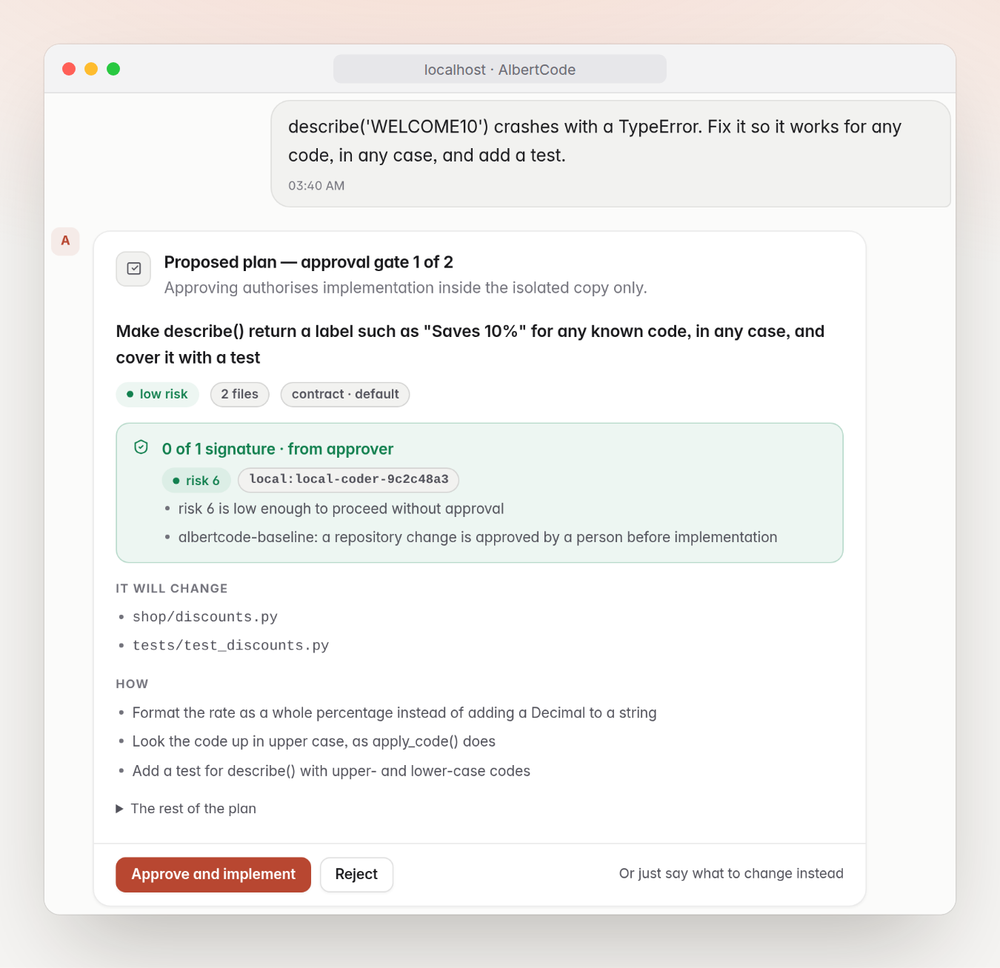
</picture>

<sub>The goal, the files it will change, how, and the risk. Nothing is written yet.</sub>

</td>
<td width="50%" valign="top">

**2 · It shows you the exact diff**

<picture>
  <source media="(prefers-color-scheme: dark)" srcset="assets/readme/screen-diff-dark.png">
  <source media="(prefers-color-scheme: light)" srcset="assets/readme/screen-diff-light.png">
  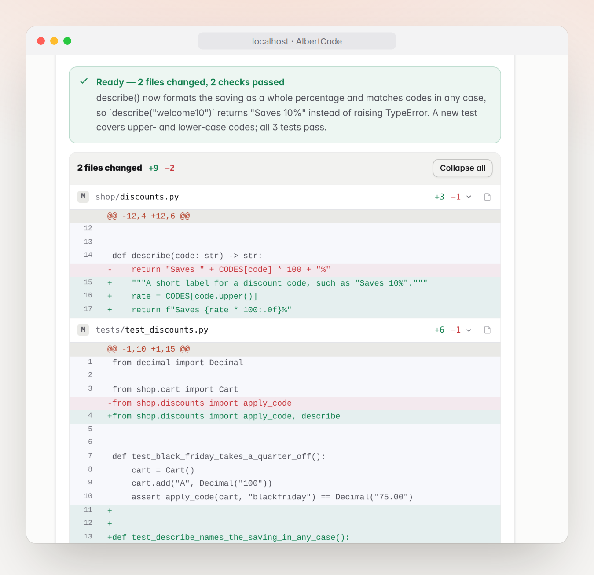
</picture>

<sub>Built in an isolated copy of your repository, never in your working tree.</sub>

</td>
</tr>
<tr>
<td width="50%" valign="top">

**3 · With the evidence**

<picture>
  <source media="(prefers-color-scheme: dark)" srcset="assets/readme/screen-evidence-dark.png">
  <source media="(prefers-color-scheme: light)" srcset="assets/readme/screen-evidence-light.png">
  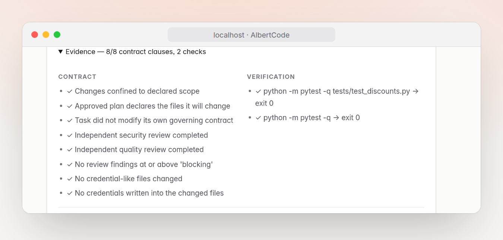
</picture>

<sub>Your own tests, independent reviews and safety checks, all recorded.</sub>

</td>
<td width="50%" valign="top">

**4 · In your terminal, too**

<picture>
  <source media="(prefers-color-scheme: dark)" srcset="assets/readme/screen-terminal-dark.png">
  <source media="(prefers-color-scheme: light)" srcset="assets/readme/screen-terminal-light.png">
  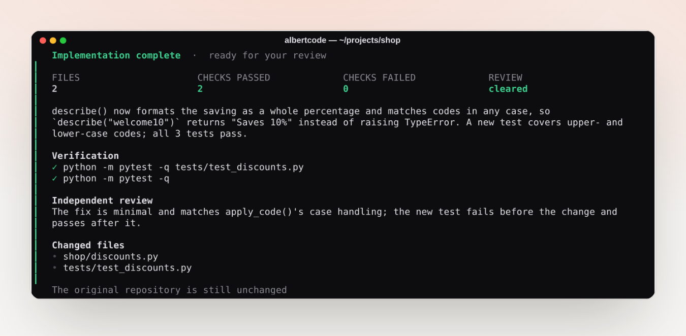
</picture>

<sub>The same task from <code>albertcode</code>. Your repository stays unchanged until you accept.</sub>

</td>
</tr>
</table>

<details>
<summary><b>Watch the terminal walkthrough</b></summary>

<br>

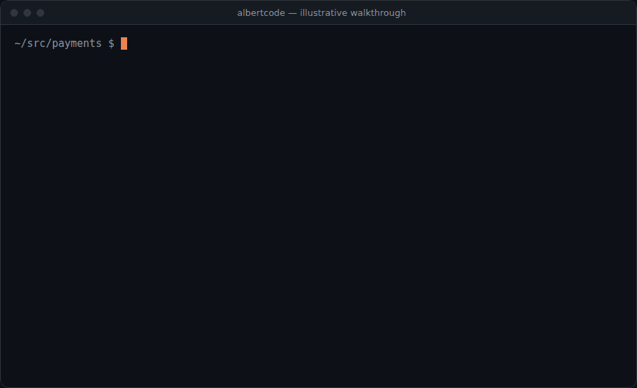

<sub>Illustrative walkthrough. The real interface shows more detail at each step.</sub>

</details>

<br>

## Why AlbertCode

<table>
<tr>
<td width="50%" valign="top">
<br>
<b>Approval built in</b><br>
<sub>Two clear decision points, so nothing reaches your repository by surprise.</sub>
</td>
<td width="50%" valign="top">
<br>
<b>Changes are proven, not just written</b><br>
<sub>AlbertCode runs your own toolchain (pytest, npm scripts, <code>go test</code>, cargo, Maven, Gradle, <code>dotnet</code>) and shows what passed and what didn't.</sub>
</td>
</tr>
<tr>
<td width="50%" valign="top">
<br>
<b>Choose your pace</b><br>
<sub><i>Governed</i> for changes you care about, <i>direct</i> to work in your files with a prompt before each write (or none, with <i>auto</i>), and <i>ask</i> to explore a codebase without changing anything.</sub>
</td>
<td width="50%" valign="top">
<br>
<b>Any model</b><br>
<sub>Connect a hosted provider or a local model, and switch at any time.</sub>
</td>
</tr>
<tr>
<td width="50%" valign="top">
<br>
<b>Three interfaces</b><br>
<sub>Terminal (<code>albertcode</code>), browser (<code>albertcode --ui</code>) and VS Code, all driving the same local service.</sub>
</td>
<td width="50%" valign="top">
<br>
<b>Private by default</b><br>
<sub>It runs on your machine, with no account and no telemetry.</sub>
</td>
</tr>
<tr>
<td width="50%" valign="top">
<br>
<b>A record of every change</b><br>
<sub>Each task keeps its plan, test results, review and diff together, in a tamper-evident log you can export.</sub>
</td>
<td width="50%" valign="top">
<br>
<b>Extensible</b><br>
<sub><a href="docs/extending.md#mcp-servers">MCP servers</a>, plus <a href="docs/extending.md">custom commands and agents</a> written as Markdown files.</sub>
</td>
</tr>
</table>

<br>

## How it works

<picture>
  <source media="(prefers-color-scheme: dark)" srcset="assets/readme/flow-dark.png">
  <source media="(prefers-color-scheme: light)" srcset="assets/readme/flow-light.png">
  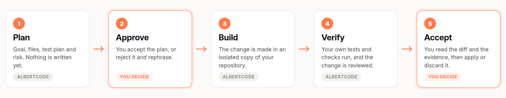
</picture>

| | Step | What you see |
|:-:|---|---|
| **1** | **Plan** | The goal, the files it expects to touch, the test plan and the risk. Nothing is written yet. |
| **2** | **Approve** &nbsp;<sub>you decide</sub> | You accept the plan, or reject it and rephrase. |
| **3** | **Build** | The change is made in an isolated copy of your repository, never in your working tree. |
| **4** | **Verify** | Your project's own tests and checks run, and the change is reviewed. |
| **5** | **Accept** &nbsp;<sub>you decide</sub> | You read the diff and the results, then apply it, or discard it. |

> [!NOTE]
> If you edited a file the change also touches, acceptance is refused rather than overwriting your
> work. Accepted changes are ordinary edits: commit them, or undo them, with Git.

<br>

## Using AlbertCode

### Three interfaces, one agent

All three use the same local service, so a task started in one can be followed in another.

| Interface | Start it | Good for |
|---|---|---|
| **Terminal** | `albertcode` in your project folder | Working where you already are |
| **Browser** | `albertcode --ui` | Reading plans and diffs side by side; several sessions at once |
| **VS Code** | The AlbertCode panel, or right-click a folder → *Open Here* | Staying in your editor |

### Three modes

Switch with `/mode`, or use one for a single request with `/plan` or `/do`.

| Mode | What happens | Use it for |
|---|---|---|
| **Governed** <sub>default</sub> | You approve a plan; it works in an isolated copy, runs your tests and reviews the result; you approve the diff | Changes you care about |
| **Direct** | It works in your files, asking before each write, or applying writes as they come with `auto`. Needs Git | Quick changes you're watching |
| **Ask** | It answers questions and changes nothing | Understanding a codebase |

### Everyday commands

Type `/help` for all of them.

| Command | What it does |
|---|---|
| `/connect` | Connect a model provider: its key, or the address of a local model |
| `/model` | Choose a model |
| `/test` | Check that a model can drive AlbertCode |
| `/plan <request>` | Start a governed change |
| `/attach <paths>` | Give it files or screenshots |
| `/tasks` | Recent tasks |
| `/status` | The repository and model in use |
| `/exit` | Leave. The service keeps running; `albertcode stop` stops it |

Every step is also a subcommand (`albertcode create`, `approve`, `diff`, `accept`), so AlbertCode
fits scripts and CI. See [Using AlbertCode](docs/usage.md).

### Files panel

In the browser (`albertcode --ui`), **Files** in the top bar shows the repository's files beside the
chat. Make a new file or folder, rename, duplicate, copy, cut and paste, copy a path, or move
something to the Trash, from the toolbar, the ⋯ menu on each row, a right-click, or the keyboard.

<picture>
  <source media="(prefers-color-scheme: dark)" srcset="assets/readme/screen-files-dark.png">
  <source media="(prefers-color-scheme: light)" srcset="assets/readme/screen-files-light.png">
  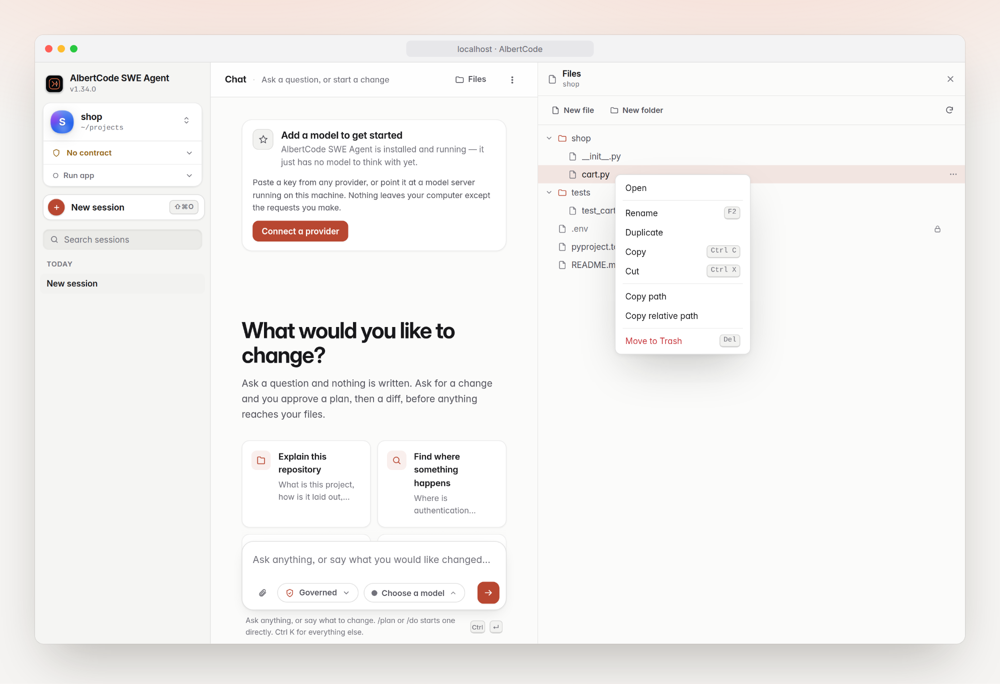
</picture>

| Shortcut | What it does |
|---|---|
| <kbd>F2</kbd> | Rename |
| <kbd>Delete</kbd> (<kbd>⌘</kbd> <kbd>⌫</kbd> on a Mac) | Move to the Trash, after you confirm |
| <kbd>Ctrl</kbd>/<kbd>⌘</kbd> <kbd>C</kbd>, <kbd>X</kbd>, <kbd>V</kbd> | Copy, cut, paste into the selected folder |
| Arrow keys, <kbd>Enter</kbd> | Move around, open a folder or file |

> [!NOTE]
> The panel only works inside the open repository and never through a link. Git's own folder is
> hidden, and files that look like they hold secrets, such as `.env` or keys, are shown with a lock
> and never opened or changed. Nothing is overwritten, and anything you delete can be restored from
> the Trash or Recycle Bin.

### Terminal

**Terminal** in the top bar (or <kbd>Ctrl</kbd> <kbd>`</kbd>) opens a real shell beside the chat,
like Files: zsh or bash on macOS and Linux, PowerShell on Windows, in the open repository. The
button in its header docks it under the chat instead, and back; AlbertCode remembers where you
like it. Open more as tabs, and hide or move it whenever you like: your shells keep running, even
across a page reload. Colours, clickable links, full-screen programs, and copy and paste all work
as in your own terminal, in light and dark. Run your project's tests and other checks here.

<picture>
  <source media="(prefers-color-scheme: dark)" srcset="assets/readme/screen-shell-dark.png">
  <source media="(prefers-color-scheme: light)" srcset="assets/readme/screen-shell-light.png">
  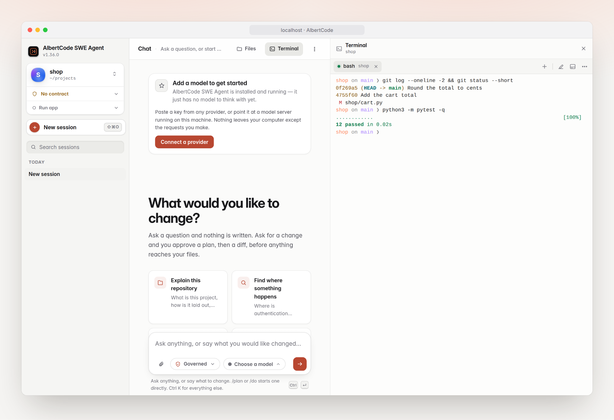
</picture>

| Shortcut | What it does |
|---|---|
| <kbd>Ctrl</kbd> <kbd>`</kbd> | Show or hide the terminal |
| <kbd>Ctrl</kbd> <kbd>Shift</kbd> <kbd>`</kbd> | New terminal tab |
| <kbd>Ctrl</kbd> <kbd>C</kbd> | Copy the selection, or interrupt when nothing is selected (<kbd>⌘</kbd> <kbd>C</kbd> on a Mac) |
| <kbd>Ctrl</kbd> <kbd>Shift</kbd> <kbd>C</kbd> / <kbd>V</kbd> | Copy, paste (<kbd>⌘</kbd> <kbd>C</kbd> / <kbd>V</kbd> on a Mac) |

> [!IMPORTANT]
> The terminal is off until you turn it on, and the panel explains what it allows first: what you
> type runs on your computer as you, outside the limits AlbertCode puts on the agent. Only your own
> AlbertCode page can connect to it, and a shared AlbertCode server never offers it. Opening and
> closing a shell are recorded in the evidence ledger; what you type is not. Turn it off at any
> time from the panel's ⋯ menu.

### Preview

**Preview** in the top bar starts your app if it is not running and shows it beside the chat. If
the project has no dev script, it asks for the start command once. Before the app starts,
AlbertCode checks its port: when something else is using it, the app gets the next free one, so it
never shows another project's app. Switch between desktop, tablet
and phone widths, restart or stop it, and open its logs. The status line says whether the app is
answering and how (`Running · localhost:5173 · 200 · 12 ms`). When something is wrong it says so
above the app: it did not start, it stopped, it answers with an error page, or its own output
reports an error now. **Ask Albert to fix** puts the error into the chat for you to send.

<picture>
  <source media="(prefers-color-scheme: dark)" srcset="assets/readme/screen-preview-dark.png">
  <source media="(prefers-color-scheme: light)" srcset="assets/readme/screen-preview-light.png">
  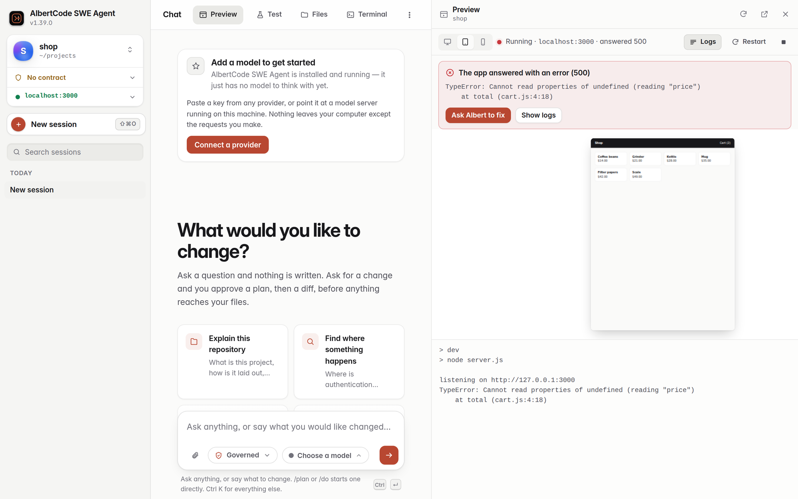
</picture>

#### Edit by clicking

Turn on **Edit** in the Preview panel and click anything in your app: a heading, a button, a card.
Change its text, text colour, background, size, weight, alignment, padding or corners, and you see
the change at once. Nothing is saved yet.

**Review change** finds where it comes from in your code. When there is exactly one safe place (the
text is written once, or the style comes from one CSS rule), it shows the diff, and **Apply
change** writes exactly that; your app reloads with it. When there is not (the text is built from
data, it appears in several places, or it is styled with utility classes), AlbertCode says why, and
**Ask Albert** makes the change as a normal task, with the plan and diff for you to approve.

<picture>
  <source media="(prefers-color-scheme: dark)" srcset="assets/readme/screen-visual-dark.png">
  <source media="(prefers-color-scheme: light)" srcset="assets/readme/screen-visual-light.png">
  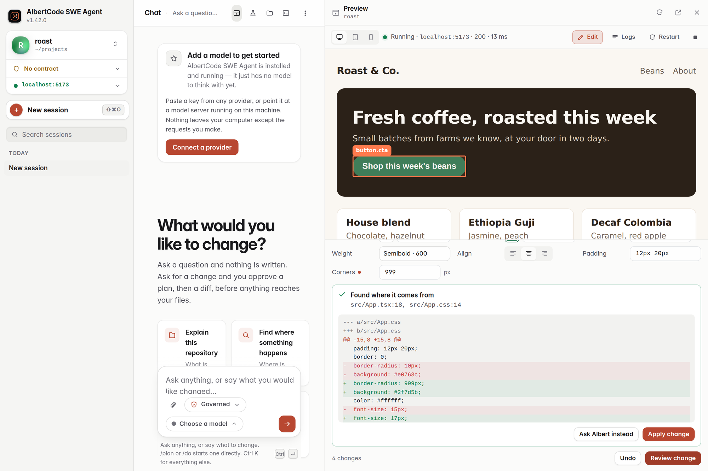
</picture>

> [!NOTE]
> Direct edits work for React with TypeScript, Next.js, Vite with React, and plain HTML, CSS and
> JavaScript. For other stacks, Albert makes every change. Apply only writes if the files are
> unchanged since you reviewed them, and each change is recorded in the evidence ledger.

### Task board

**Tasks**, in the ⋮ menu at the top right, shows every task on a board, in columns for where each
one stands: Planned, Active, Blocked, Verifying and Completed. Each card shows how far it has come, what it is
waiting for ("Plan waiting for you", "Diff waiting for you"), its checks and files, and why it
failed if it did. Open a card to pick the task up where it is. **List** shows the same tasks as a
searchable list.

<picture>
  <source media="(prefers-color-scheme: dark)" srcset="assets/readme/screen-board-dark.png">
  <source media="(prefers-color-scheme: light)" srcset="assets/readme/screen-board-light.png">
  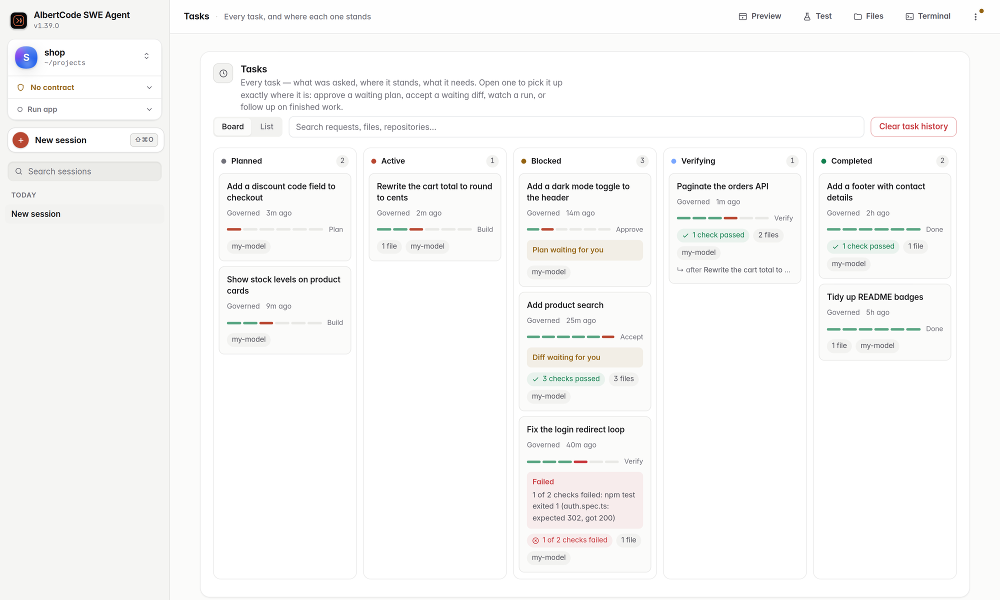
</picture>

### Browser tests

**Test** in the top bar checks your app the way a person uses it: pages, forms, saved data and
sign-in. The tests are Playwright files in your repository's `e2e/` folder, so you can read them,
change them, run them yourself with `npx playwright test`, and commit them.

1. **Write browser tests** asks Albert for them as a normal task: you approve the plan and the diff.
2. **Install** adds the test runner with your project's package manager.
3. **Run tests** starts the app if needed, runs every test in a browser, and shows what passed and
   what failed. A failure comes with its error, the line in the test, a screenshot and a trace,
   and **Fix with Albert** starts a task with all of that in it.

<picture>
  <source media="(prefers-color-scheme: dark)" srcset="assets/readme/screen-tests-dark.png">
  <source media="(prefers-color-scheme: light)" srcset="assets/readme/screen-tests-light.png">
  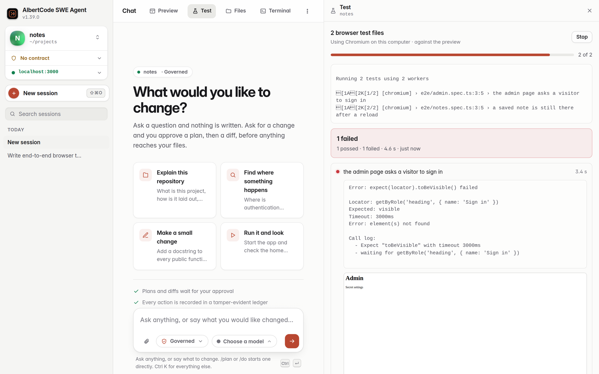
</picture>

> [!NOTE]
> AlbertCode uses a Chrome, Edge or Chromium that is already on your computer. Only if there is
> none does it offer to download Playwright's Chromium (about 150 MB), and only when you ask.
> Results come from Playwright's own report: a run that leaves no report is shown as not having
> run, never as a pass.

### Requirements

**Requirements**, in the ⋮ menu, turns your specification into a checklist and shows where each
item stands. Paste the specification and your model drafts one requirement per behaviour; edit
the list and save it. It is kept in your repository as `.albertcode/requirements.json`, numbered
R1, R2 and so on, beside the code it describes.

Each requirement's status is worked out from evidence, never guessed:

| Status | When |
|---|---|
| **Complete** | It has browser tests, and all of them passed in the latest run |
| **Partial** | Some of its tests passed, or it was built but no test checks it yet |
| **Failed** | One of its tests failed, or the task that built it failed |
| **Missing** | Nothing has built it, and no test has passed for it |

Each row says why, lists the tests and tasks behind it, and offers the next step: **Build with
Albert**, **Fix with Albert** or **Add a test**. What they make links back by itself: a browser
test titled `[R3] …` checks R3.

<picture>
  <source media="(prefers-color-scheme: dark)" srcset="assets/readme/screen-requirements-dark.png">
  <source media="(prefers-color-scheme: light)" srcset="assets/readme/screen-requirements-light.png">
  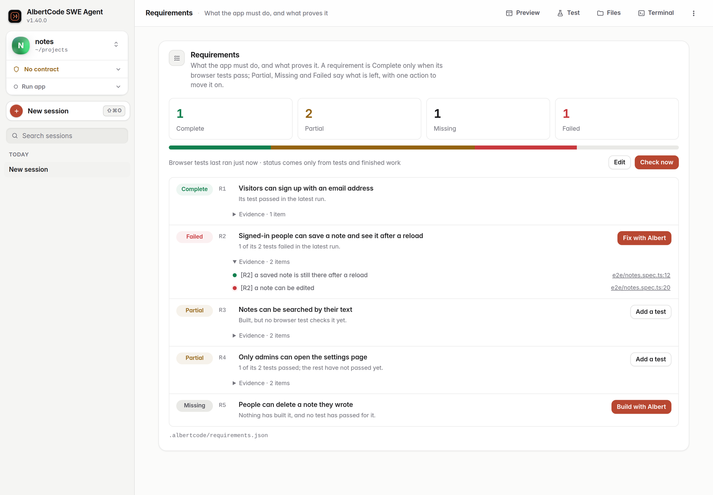
</picture>

### Architecture

**Architecture**, in the ⋮ menu, draws what your app is made of and how the parts connect, from
its own files, in three columns: what people use (frontends and web pages), what runs (API servers
and background jobs), and what it relies on (databases, caches, sign-in, queues, file storage and
outside services such as payments or email).

Nothing is guessed. Every box comes from a file that declares it (`package.json`,
`pyproject.toml`, `requirements.txt`, `go.mod`, `docker-compose.yml`, or the names in
`.env.example`), and a line is drawn only where a file shows the connection. Select a part to see
those files, what it connects to and why, and its routes, pages and data models, each one click
from the code.

<picture>
  <source media="(prefers-color-scheme: dark)" srcset="assets/readme/screen-architecture-dark.png">
  <source media="(prefers-color-scheme: light)" srcset="assets/readme/screen-architecture-light.png">
  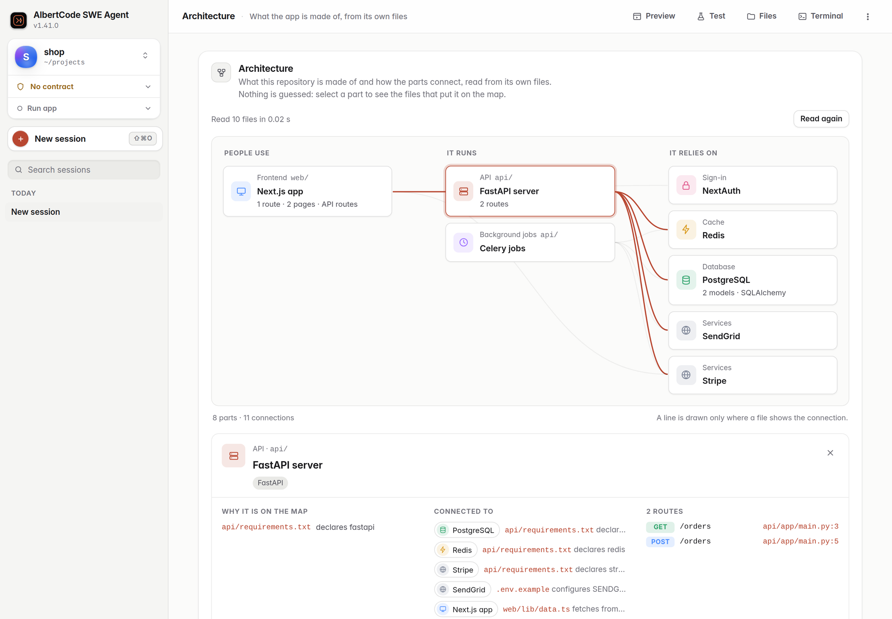
</picture>

<br>

### System

**System**, in the ⋮ menu, puts every part of your app and every service it relies on onto one map,
and checks that each one really works.

- **It starts from your code.** The web app, the API, background jobs, the database, the cache,
  payments, email and the rest appear on their own, read from your repository's files.
- **Add anything from the library.** 109 services, each with its logo, what it is, how it is checked
  and what Albert can do with it: databases, caches and queues, sign-in, payments, email and
  messaging, storage, hosting, monitoring, analytics, search, AI services, content tools, and your
  own APIs or MCP servers. Search it, then drag a service onto the map or press **+**.
- **Arrange it your way.** Drag the boxes; they stay where you put them. Select a line to see which
  file shows that connection, and go to either end. On a narrow window the map becomes a list.
- **Connected means checked.** Give a service its address and key and AlbertCode checks it straight
  away, read-only: it signs in and asks something harmless, and never writes or sends anything. A
  service is marked working only when that check signed in; otherwise it says what went wrong.
  **Check everything** checks every connected service at once.
- **Albert beside every box.** Ask why something fails or what depends on it, and your model answers
  from the last check. **Fix with Albert**, **Wire it into the app** and each service's own actions
  run in a panel beside the map, so you see Albert work and approve the plan and the change there.

Keys stay in your computer's key store: never in your repository, a log, the page or a model's view.

<picture>
  <source media="(prefers-color-scheme: dark)" srcset="assets/readme/screen-system-dark.png">
  <source media="(prefers-color-scheme: light)" srcset="assets/readme/screen-system-light.png">
  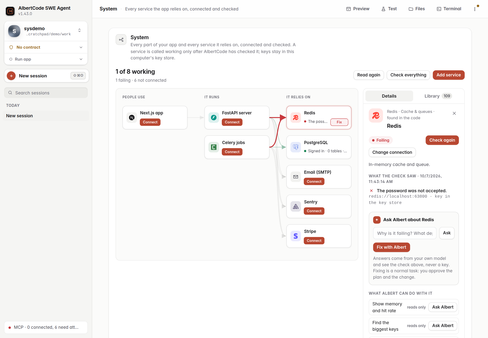
</picture>

<picture>
  <source media="(prefers-color-scheme: dark)" srcset="assets/readme/screen-system-albert-dark.png">
  <source media="(prefers-color-scheme: light)" srcset="assets/readme/screen-system-albert-light.png">
  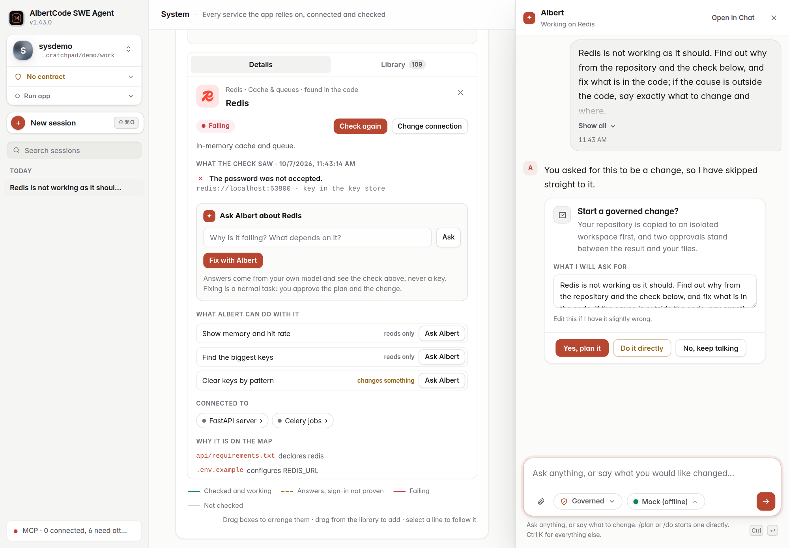
</picture>

<br>

## Models

| Provider | Connect with |
|---|---|
| Major hosted model providers, and Kimi | An API key |
| OpenRouter | An API key: many vendors' models through one account |
| Hugging Face | A token, for open-weight models |
| Any compatible API service | Its address, and a key if it needs one |
| Your own machine | Ollama, LM Studio, vLLM or another local model server |

AlbertCode checks a key or address works before saving it. The model must support tool calling;
`/test` checks one in a single request. More in [Models](docs/models.md).

<br>

## Troubleshooting

<details>
<summary><b>Installing</b> &nbsp;·&nbsp; command not found, macOS and Windows warnings, Linux, networks</summary>

<br>

| Problem | Fix |
|---|---|
| `albertcode: command not found` right after installing | Open a new terminal. The installer added the command to your PATH, and only new terminals see it |
| **macOS:** "could not be executed because you do not have appropriate access privileges" | The browser saved the installer without permission to run. Download the `.zip` for your Mac instead, or run `bash ~/Downloads/Install-AlbertCode-<version>-macos-arm64.command` in Terminal (`x86_64` on Intel) |
| **macOS:** "Apple could not verify…" or "unidentified developer" | Open **System Settings → Privacy & Security**, click **Open Anyway**, and open the installer again. Or use the one-line command |
| **Windows:** "Windows protected your PC" | Choose *More info* → *Run anyway* |
| **Windows:** PowerShell refuses to run the command | Your organisation may block scripts. Download the `.cmd` installer from the release and double-click it instead |
| **Windows:** "failed to remove directory …\Scripts: Access is denied (os error 5)" | AlbertCode was still open somewhere, and Windows does not let a running program's files be replaced. Installers from 1.42.2 close it for you after asking. With an older one, close every terminal and VS Code window using AlbertCode (or run `albertcode stop`), then run the installer again |
| **Linux:** the installer refuses to run under `sudo` | Run it as yourself. It installs for your user, and asks for `sudo` only if Git is missing |
| **Linux:** "the release has no installer for Linux on … processors" | Only x86-64 is supported for now, not ARM |
| **Linux:** the install fails on Alpine or another musl-based system | Not supported: AlbertCode needs a glibc-based distribution such as Ubuntu, Debian or Fedora |
| pypi.org can't be reached | Check your connection. Behind a proxy, set `HTTPS_PROXY` and run the command again |
| `invalid peer certificate` or `UnknownIssuer` | Your network inspects encrypted traffic. Current installers retry with your computer's certificates; if that fails, set `UV_NATIVE_TLS=1` and run again |
| "the package inside it is damaged" | The download was cut short or altered. Download it again |

Every installer run writes a log: `~/.local/share/albertcode-installer/install.log` on macOS and
Linux, `%LOCALAPPDATA%\AlbertCode\install.log` on Windows.

</details>

<details>
<summary><b>Running</b> &nbsp;·&nbsp; model connection, tests, browser sign-in, VS Code, stuck tasks</summary>

<br>

| Problem | Fix |
|---|---|
| "No model is connected" | Run `/connect`, or choose **Connect a provider** in the browser or VS Code |
| After updating, your model is no longer connected | Saved keys are cleared when a new version first starts. Run `/connect` again |
| A model connects but tasks stall or fail early | The model may not handle tool calling well. Run `/test`, and see [Models](docs/models.md#what-a-model-needs) |
| Tests don't run, or use the wrong tool | Run `albertcode doctor` to see which build tools AlbertCode finds, then install or add the missing one to your PATH |
| The browser page says to open AlbertCode from your terminal | Run `albertcode --ui`. It signs your browser in |
| **macOS:** "New folder" says the folder is read-only | You are at the top of the disk ("This computer") or in a system folder. Choose **Home** or **Documents** in the picker and make the folder there |
| VS Code can't reach AlbertCode | Run `albertcode` once in a terminal to start the service, then reload the VS Code window |
| The preview says "localhost refused to connect" but the app opens in its own tab | Update to 1.42.1 or later: apps that forbid being shown inside another page now show in the preview too |
| The app starts on a different port than usual | Its usual port was busy, so AlbertCode gave it a free one. The status line shows where it is; nothing else using the usual port is touched |
| Accepting a change is refused | You edited a file the change also touches. Look at your edits, then run the task again |
| Everything seems stuck | Run `albertcode stop`, then `albertcode` again |

</details>

> [!TIP]
> Still stuck? [Open an issue](https://github.com/huynvic/albertcode-swe-agent/issues/new/choose) with
> what you ran, what you expected and what happened, plus `albertcode --version` and your operating
> system. More fixes are in [Troubleshooting](docs/troubleshooting.md).

> [!CAUTION]
> Never include keys, tokens or private code in an issue.

<br>

## Privacy and security

<table>
<tr>
<td width="50%" valign="top">

**Your code** goes only to the model provider you choose. With a local model, it never leaves your
machine.

**No telemetry and no account.**

</td>
<td width="50%" valign="top">

**Saved keys** are kept by your system's own protection (the macOS Keychain, Windows data
protection or your Linux keyring), and are never given to the commands AlbertCode runs.

**Only AlbertCode itself** can use the service it runs on your computer.

</td>
</tr>
</table>

See the [security model](docs/security.md) and [PRIVACY.md](PRIVACY.md). To report a
vulnerability, follow [SECURITY.md](SECURITY.md).

<br>

## Benchmarks

<table>
<tr>
<td align="center" width="34%">
<h1>39 / 51</h1>
<sub>resolved &nbsp;·&nbsp; 76%</sub>
</td>
<td valign="top">

**[SWE-bench Pro HARD-51](benchmarks/results/swe-bench-pro-hard51-2026-09-frontier-model/REPORT.md)**<br>
Model: a frontier hosted model<br>
One attempt per task, up to 50 minutes each, no human help<br>
Held out from all development: **14 of 22** resolved

</td>
</tr>
</table>

SWE-bench Pro is Scale AI's benchmark of real software-engineering work: issues and features in
professional open-source projects, judged by each project's own hidden tests. HARD-51 is its
hardest part, the tasks that at least two of five frontier model families failed.

> [!NOTE]
> **Self-reported.** We ran and graded this ourselves; it hasn't been independently verified. The
> [report](benchmarks/results/swe-bench-pro-hard51-2026-09-frontier-model/REPORT.md) gives the
> method, every task's outcome and the limitations.

<br>

## Documentation

| Guide | What's in it |
|---|---|
| [**Getting started**](docs/getting-started.md) | Install, connect a model, and complete a first task |
| [**Installation**](docs/installation.md) | Options, updating, uninstalling and requirements |
| [**Using AlbertCode**](docs/usage.md) | Modes, approvals, commands and scripting |
| [**Models**](docs/models.md) | Providers, local models, and what a model needs |
| [**Extending**](docs/extending.md) | Custom commands, custom agents and MCP servers |
| [**Security model**](docs/security.md) | How your keys, code and data are protected |
| [**Troubleshooting**](docs/troubleshooting.md) | Fixes for common problems |
| [**FAQ**](docs/faq.md) | Short answers |

<br>

## FAQ

<details>
<summary><b>How is AlbertCode different from other coding agents?</b></summary>

<br>

Many agents edit your working tree as they go, and leave you to work out whether the result is
right. AlbertCode builds the change in an isolated copy. It runs your own tests, reviews the
change, and brings you a diff with the evidence, and you decide whether it lands. When you want
speed instead, direct mode skips the ceremony.

</details>

<details>
<summary><b>Is AlbertCode open source?</b></summary>

<br>

No. AlbertCode SWE Agent is a proprietary product. This repository is open: its documentation,
installer, examples and benchmark methodology welcome contributions. See
[the FAQ](docs/faq.md#is-albertcode-open-source).

</details>

<details>
<summary><b>Does it cost anything?</b></summary>

<br>

You use your own model provider account, or a free local model. AlbertCode doesn't charge for
model usage.

</details>

<br>

## Community

| | |
|---|---|
| **Questions and ideas** | [Discussions](https://github.com/huynvic/albertcode-swe-agent/discussions) |
| **Bugs and feature requests** | [Issues](https://github.com/huynvic/albertcode-swe-agent/issues/new/choose) |
| **What's coming** | The [roadmap](ROADMAP.md) and the [changelog](CHANGELOG.md) |
| **Contributing** | Docs, examples, the installer and integrations. See [CONTRIBUTING.md](CONTRIBUTING.md) |

<div align="center">

<br>

**If AlbertCode saves you time, a ⭐ helps other developers find it.**

</div>

<br>

## License

AlbertCode SWE Agent is proprietary software, and it isn't covered by the licences in this
repository. Code in this repository is [Apache-2.0](LICENSE), and its documentation is
[CC BY 4.0](https://creativecommons.org/licenses/by/4.0/). See [LICENSING.md](LICENSING.md).

<div align="center">
<br>

</div>
